<h2>Land Use Change Calculus (lucCalculus)</h2>

This package implements the LUC Calculus for reasoning about land use change events. Based on a set of classified time series, we build expressions to answer specific questions, such as <i>Which events of "Forest" areas were replaced by "Pasture"?</i>

With package "lucCalculus" is possible to build questions using Allen's interval temporal logic relationships and also others extended from their study. I suggest the reader read <a href="http://cse.unl.edu/~choueiry/Documents/Allen-CACM1983.pdf"> (Allen 1983)</a> and <a href="http://www.cs.ucf.edu/~lboloni/Teaching/EEL6938_2007/papers/Allen-GeneralTheoryActionTime.pdf"> (Allen 1984) </a> for more details. Besides, is possible to generate graphics with event information and plot maps with results. Using these events the user can to perform analysis on time series data to discover important land use changes.

Classification method and others tools to Satellite Image Time Series analysis can be found using package sits at <a href="https://github.com/e-sensing/sits">https://github.com/e-sensing/sits</a>

<h3>Prerequisites: </h3> 
<ul>
  <li><a href="http://git-scm.com/">Git</a></li>
  <li><a href="http://www.r-project.org/">R</a></li>
  <li><a href="http://www.rstudio.com/">Rstudio</a></li>
  <li>A set of classified GeoTIFF images by year </li>
  <li>The lucCalculus requires "devtools" package is available. </li> 
</ul>

<h3>How to use the package:</h3>
<ul>
  <li>Open RStudio</li>
  <li>Install devtools <code>install.packages("devtools")</code> </li>
  <li>Load devtools <code>library(devtools)</code> </li>
  <li>Install the lucCalculus package <code>install_github("ammaciel/lucCalculus")</code> </li>
</ul>

 
<h3>Example 1</h3>

 - Load the lucCalculus package <code>library(lucCalculus)</code>

 - Create a RasterBrick from a set of classified images

<pre class="R"> library(lucCalculus)
#-----------------------
# 0. Open images and create a RasterBrick with each one and metadata with SITS
#-----------------------

# create a RasterBrick from individual raster GeoTIFF classified previously
lucC_create_RasterBrick(path_open_GeoTIFFs = "inst/extdata/raster/raster_sample_MT", path_save_RasterBrick = "inst/extdata/raster")

# ------------- define variables to use in sits -------------
# open files
file <- c("inst/extdata/raster/raster_sample_MT.tif")
file

# create timeline with classified data from SVM method
timeline <- lubridate::as_date(c("2001-09-01", "2002-09-01", "2003-09-01", "2004-09-01", "2005-09-01", "2006-09-01", "2007-09-01", "2008-09-01", "2009-09-01", "2010-09-01", "2011-09-01", "2012-09-01", "2013-09-01", "2014-09-01", "2015-09-01", "2016-09-01"))
timeline

# library(sits)
# create a RasterBrick metadata file based on the information about the files
raster.tb <- sits::sits_coverage(service = "RASTER", files = file, name = "Sample_region", timeline = timeline, bands = "ndvi")
raster.tb

# new variable with raster object
rb_sits <- raster.tb$r_objs[[1]][[1]]

# ------------- define variables to plot raster -------------
# original label - see QML file, same order
label <- as.character(c("Cerrado", "Fallow_Cotton", "Forest", "Pasture", "Soy_Corn", "Soy_Cotton", "Soy_Fallow", "Soy_Millet", "Soy_Sunflower", "Sugarcane", "Urban_Area", "Water"))

# original colors set - see QML file, same order
colors_1 <- c("#b3cc33", "#8ddbec", "#228b22", "#afe3c8", "#b6a896", "#e1cdb6", "#e5c6a0", "#b69872", "#b68549", "#dec000", "#cc18b4", "#0000f1" )

# plot rasterBrick
lucC_plot_raster(raster_obj = rb_sits,
                 timeline = timeline, label = label,
                 custom_palette = TRUE, RGB_color = colors_1, plot_ncol = 6)

</pre>

 - Plotted RasterBrick rb_sits 

<table width="700" border="0">
<tr>
<td align="center" valign="center">

Fig. 1. Plot images classified from a RasterBrick

</td>
</tr>
</table>

 - Apply lucC_pred_holds function to discover events of <i>Forest</i> and <i>Cerrado</i> in different time intervals. Parameter <i>relation_interval = "equals"</i> or <i>"contains"</i> produce different results to HOLDS. "Equals" says that all states/events must holds for each subinterval of time interval, whereas "Contains" says that one state/event can appear only once in entire time interval. 

<pre class="R">
# Forest holds from 2001 to 2007
a <- lucC_pred_holds(raster_obj = rb_sits, raster_class = "Forest",
                     time_interval = c("2001-09-01","2007-09-01"),
                     relation_interval = "equals", label = label, timeline = timeline)
a

# Cerrado holds from 2012 to 2013
b <- lucC_pred_holds(raster_obj = rb_sits, raster_class = "Cerrado",
                     time_interval = c("2012-09-01","2013-09-01"),
                     relation_interval = "contains", label = label, timeline = timeline)
b

# before Allen's Relation
c <- lucC_relation_before(a, b)

# plot results
# individual locations over time
lucC_plot_sequence_events(c, custom_palette = FALSE, show_y_index = FALSE)

# barplot with result quantified
lucC_plot_bar_events(c, custom_palette = FALSE, pixel_resolution = 232, side_by_side = TRUE)

# plot RasterBrick with individual states over time
lucC_plot_raster_result(raster_obj = rb_sits, data_mtx = c, timeline = timeline, label = label, custom_palette = TRUE, RGB_color = colors_1, relabel = FALSE) 
</pre>

<table width="700" border="0" cellspacing="0" cellpadding="0">
<tr>
<td align="center" valign="center">
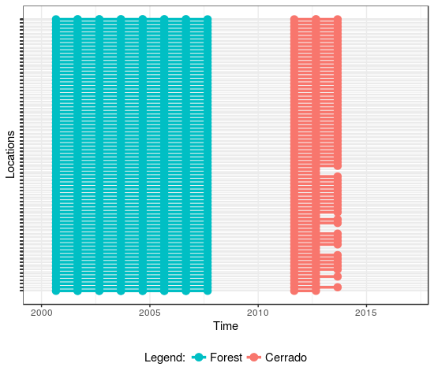
 
Fig. 2.(a) Locations over time
</td>

<td align="center" valign="center">
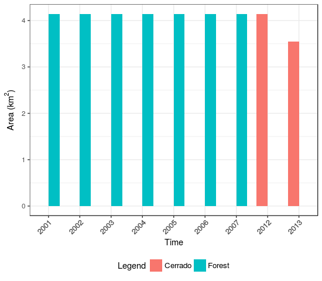
 
Fig. 2.(b) Barplot with number of states in km²
</td>

</tr>
</table>
 

- Plotted RasterBrick rb_sits results

<table width="700" border="0">
<tr>
<td align="center" valign="center">
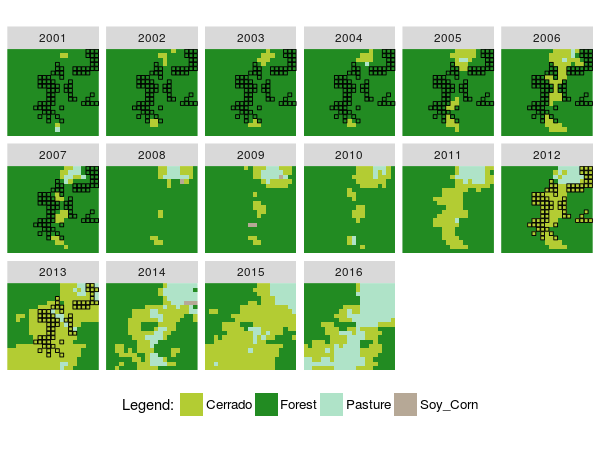

Fig. 3. Plot images classified from a RasterBrick and states from Before relation

</td>
</tr>
</table>

 
<h3>Example 2</h3>

- Apply LUC Calculus to discover secondary vegetation from RasterBrick. We are insterested only in Forest class that RECUR after a non-sequential interval and Forest that EVOLVE after a different class in 2001. After this we update the original raster.

<pre class="R">
#----------------------------
# 1. RECUR predicate indicates a class that appear again
#----------------------------

forest_recur <- lucC_pred_recur(raster_obj = rb_sits, raster_class = "Forest",
                                    time_interval1 = c("2001-09-01","2001-09-01"),
                                    time_interval2 = c("2003-09-01","2016-09-01"),
                                    label = label, timeline = timeline)
head(forest_recur)

#-------------------
# plot some results from RECUR
lucC_plot_sequence_events(forest_recur, custom_palette = FALSE, show_y_index = FALSE)
lucC_plot_bar_events(forest_recur, custom_palette = FALSE)

lucC_plot_raster_result(raster_obj = rb_sits, data_mtx = forest_recur, 
                        timeline = timeline, label = label, custom_palette = TRUE, 
                        RGB_color = colors_1, relabel = FALSE) #, shape_point = "#")
#-------------------
</pre>

<table width="700" border="0" cellspacing="0" cellpadding="0">
<tr>
<td align="center" valign="center">
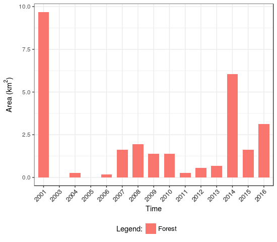
 
Fig. 4.(a) Locations over time
</td>

<td align="center" valign="center">
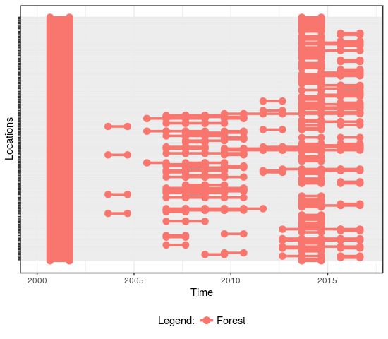
 
Fig. 4.(b) Barplot with number of states in km²
</td>

</tr>
</table>

 
- Plotted RasterBrick rb_sits results

<table width="700" border="0">
<tr>
<td align="center" valign="center">
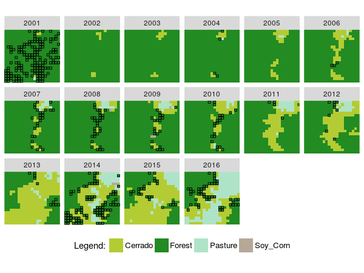

Fig. 5. Plot images classified from a RasterBrick and states from RECUR relation

</td>
</tr>
</table>

<pre class="R">
#----------------------------
# 2. EVOLVE to verify Forest class that occurs after a different class in 2001
#----------------------------
forest_evolve <- NULL

# classes without Forest based on original label
classes <- as.character(c("Cerrado", "Fallow_Cotton", "Pasture", "Soy_Corn", "Soy_Cotton", "Soy_Fallow", "Soy_Millet", "Soy_Sunflower", "Sugarcane", "Urban_Area", "Water"))

# percor all classes
for(i in seq_along(classes)){
  print(classes[i])
  temp <- lucC_pred_evolve(raster_obj = rb_sits, raster_class1 = classes[i],
                           time_interval1 = c("2001-09-01","2001-09-01"), relation_interval1 = "equals",
                           raster_class2 = "Forest",
                           time_interval2 = c("2002-09-01","2016-09-01"), relation_interval2 = "contains",
                           label = label, timeline = timeline)
  
  forest_evolve <- lucC_merge(forest_evolve, temp)
}

#-------------------
# plot some results from EVOLVE
lucC_plot_sequence_events(forest_evolve, custom_palette = FALSE, show_y_index = FALSE)
lucC_plot_bar_events(forest_evolve, custom_palette = FALSE, legend_text = "Legend:")

lucC_plot_raster_result(raster_obj = rb_sits, data_mtx = forest_evolve, 
                        timeline = timeline, label = label, custom_palette = TRUE, 
                        RGB_color = colors_1, relabel = FALSE) #, shape_point = "#")
#-------------------
</pre>

<table width="700" border="0" cellspacing="0" cellpadding="0">
<tr>
<td align="center" valign="center">
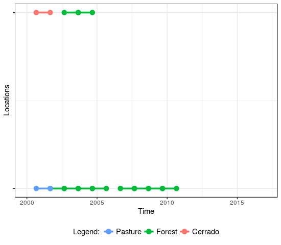
 
Fig. 6.(a) Locations over time
</td>

<td align="center" valign="center">
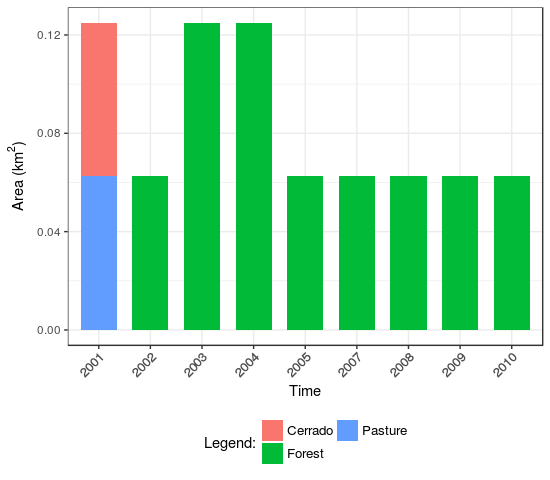
 
Fig. 6.(b) Barplot with number of states in km²
</td>

</tr>
</table>
 

- Plotted RasterBrick rb_sits results

<table width="700" border="0">
<tr>
<td align="center" valign="center">
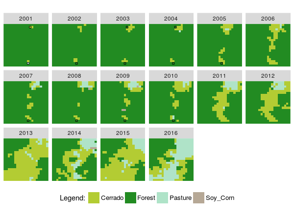

Fig. 7. Plot images classified from a RasterBrick and states from EVOLVE relation

</td>
</tr>
</table>

<pre class="R">
#----------------------------
# 3. Merge both forest_recur and forest_evolve data sets
#----------------------------

forest_secondary <- lucC_merge(forest_evolve, forest_recur)
head(forest_secondary)

# plot
lucC_plot_bar_events(forest_secondary, custom_palette = FALSE, pixel_resolution = 232, legend_text = "Legend:")

# 4. Remove column 2001 because it' is not used to replace pixels's only support column
forest_sec <- lucC_remove_columns(data_mtx = forest_secondary, name_columns = c("2001-09-01"))
head(forest_sec)

# plot
lucC_plot_bar_events(forest_sec, custom_palette = FALSE, pixel_resolution = 232, legend_text = "Legend:")

# 5. Plot secondary vegetation over raster without column 2001 because it' is not used to replace pixels's only support column
lucC_plot_raster_result(raster_obj = rb_sits,
                        data_mtx = forest_sec,
                        timeline = timeline,
                        label = label, custom_palette = TRUE,
                        RGB_color = colors_1, relabel = FALSE) #, shape_point = ".")

</pre>

- Plotted RasterBrick rb_sits results of secondary vegetation

<table width="700" border="0">
<tr>
<td align="center" valign="center">
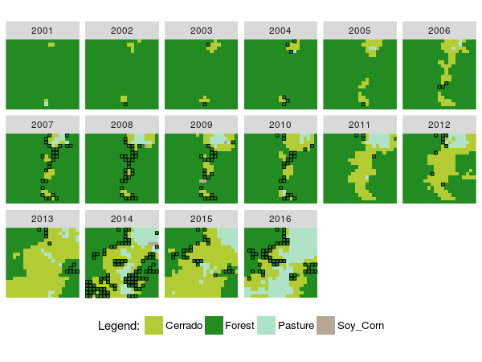

Fig. 8. Plot images classified from a RasterBrick and states from EVOLVE relation

</td>
</tr>
</table>

 
<h3>Example 3</h3>

- Update a raster with new value of pixel and open rasterBrick with new label.

<pre class="R">
#----------------------------
# 4. Update original raster to add new pixel value
#----------------------------
label_new <- length(label)+1
# 1. update original RasterBrick with new class
rb_sits_new <- lucC_update_raster(raster_obj = rb_sits,
                                  data_mtx = forest_sec,        # without 2001
                                  timeline = timeline,
                                  class_to_replace = "Forest",  # only class Forest
                                  new_pixel_value = label_new)  # new pixel value

head(rb_sits_new)

lucC_plot_bar_events(data_mtx = rb_sits_new, pixel_resolution = 232, custom_palette = FALSE)

# 2. save the update matrix as GeoTIFF images
lucC_save_GeoTIFF(raster_obj = rb_sits,
                  data_mtx = rb_sits_new,
                  path_raster_folder = "inst/extdata/raster/raster_sampleSecVeg1", 
                  as_RasterBrick = TRUE )

#------------
# create a RasterBrick from individual raster GeoTIFF, case saved as separate layers in lucC_save_GeoTIFF, as_RasterBrick = FALSE
# lucC_create_RasterBrick(path_open_GeoTIFFs = "inst/extdata/raster/raster_sampleSecVeg", path_save_RasterBrick = "inst/extdata/raster")
# file <- c("inst/extdata/raster/raster_sampleSecVeg.tif")

# open file RasterBrick
file <- c("inst/extdata/raster/raster_sampleSecVeg1/New_raster_sampleSecVeg1.tif")

# create timeline with classified data from SVM method
timeline <- lubridate::as_date(c("2001-09-01", "2002-09-01", "2003-09-01", "2004-09-01", "2005-09-01", "2006-09-01", "2007-09-01", "2008-09-01", "2009-09-01", "2010-09-01", "2011-09-01", "2012-09-01", "2013-09-01", "2014-09-01", "2015-09-01", "2016-09-01"))

# library(sits)
# create a RasterBrick metadata file based on the information about the files
raster.tb <- sits::sits_coverage(service = "RASTER", files = file, name = "Sample_region_SecVeg", timeline = timeline, bands = "ndvi")

# new variable with raster object
rb_sits2 <- raster.tb$r_objs[[1]][[1]]

# ------------- define variables to plot raster -------------
# original label - see QML file, same order
label2 <- as.character(c("Cerrado", "Fallow_Cotton", "Forest", "Pasture", "Soy_Corn", "Soy_Cotton", "Soy_Fallow", "Soy_Millet", "Soy_Sunflower", "Sugarcane", "Urban_Area", "Water", "Secondary_Vegetation"))

# original colors set - see QML file, same order
colors_2 <- c("#b3cc33", "#8ddbec", "#228b22", "#afe3c8", "#b6a896", "#e1cdb6", "#e5c6a0", "#b69872", "#b68549", "#dec000", "#cc18b4", "#0000f1", "red" )

# plot rasterBrick
lucC_plot_raster(raster_obj = rb_sits2,
                 timeline = timeline, label = label2,
                 custom_palette = TRUE, RGB_color = colors_2, plot_ncol = 6)

</pre>

 
- Plotted RasterBrick rb_sits results with new class Secondary Vegetation

<table width="700" border="0">
<tr>
<td align="center" valign="center">
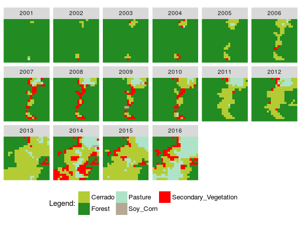

Fig. 9. Plot a RasterBrick and states with new secondary vegetation class

</td>
</tr>
</table>

 
<h3>Example 4</h3>

- Difference between Forest and Secondary Vegetatation

<pre class="R">
#----------------------------
# 5. Discover Forest and Secondary vegetation - LUC Calculus
#----------------------------

label2 <- as.character(c("Cerrado", "Fallow_Cotton", "Forest", "Pasture", "Soy_Corn", "Soy_Cotton", "Soy_Fallow", "Soy_Millet", "Soy_Sunflower", "Sugarcane", "Urban_Area", "Water", "Secondary_Vegetation"))

# original colors set - see QML file, same order
colors_2 <- c("#b3cc33", "#8ddbec", "#228b22", "#afe3c8", "#b6a896", "#e1cdb6", "#e5c6a0", "#b69872", "#b68549", "#dec000", "#cc18b4", "#0000f1", "red" )

secondary.mtx <- lucC_pred_holds(raster_obj = rb_sits2, raster_class = "Secondary_Vegetation",
                                 time_interval = c("2001-09-01","2016-09-01"),
                                 relation_interval = "contains", label = label2, timeline = timeline)
head(secondary.mtx)

forest.mtx <- lucC_pred_holds(raster_obj = rb_sits2, raster_class = "Forest",
                              time_interval = c("2001-09-01","2016-09-01"),
                              relation_interval = "contains", label = label2, timeline = timeline)
head(forest.mtx)

Forest_secondary.mtx <- lucC_merge(secondary.mtx, forest.mtx)
head(Forest_secondary.mtx)

# plot results
lucC_plot_bar_events(data_mtx = Forest_secondary.mtx,
                     pixel_resolution = 232, custom_palette = FALSE, side_by_side = TRUE)

# Compute values
measuresFor_Sec <- lucC_result_measures(data_mtx = Forest_secondary.mtx, pixel_resolution = 232)
measuresFor_Sec

#------------
  Years              Classes Pixel_number  Area_km2     CumSum Relative_Frequency Cumulative_Relative_Frequency
1   2001               Forest          416 22.390784  22.390784          8.5036795                     8.5036795
2   2002               Forest          410 22.067840  44.458624          8.3810303                    16.8847097
3   2003               Forest          406 21.852544  66.311168          8.2992641                    25.1839738
4   2004               Forest          402 21.637248  87.948416          8.2174980                    33.4014718
5   2005               Forest          387 20.829888 108.778304          7.9108749                    41.3123467
6   2006               Forest          361 19.430464 128.208768          7.3793949                    48.6917416
7   2007               Forest          361 19.430464 147.639232          7.3793949                    56.0711365
8   2008               Forest          354 19.053696 166.692928          7.2363042                    63.3074407
9   2009               Forest          343 18.461632 185.154560          7.0114473                    70.3188880
10  2010               Forest          342 18.407808 203.562368          6.9910057                    77.3098937
11  2011               Forest          300 16.147200 219.709568          6.1324612                    83.4423549
12  2012               Forest          276 14.855424 234.564992          5.6418643                    89.0842191
13  2013               Forest          146  7.858304 242.423296          2.9844644                    92.0686836
14  2014               Forest          146  7.858304 250.281600          2.9844644                    95.0531480
15  2015               Forest          123  6.620352 256.901952          2.5143091                    97.5674571
16  2016               Forest          119  6.405056 263.307008          2.4325429                   100.0000000
17  2001 Secondary_Vegetation            0  0.000000   0.000000          0.0000000                     0.0000000
18  2002 Secondary_Vegetation            1  0.053824   0.053824          0.3174603                     0.3174603
19  2003 Secondary_Vegetation            2  0.107648   0.161472          0.6349206                     0.9523810
20  2004 Secondary_Vegetation            6  0.322944   0.484416          1.9047619                     2.8571429
21  2005 Secondary_Vegetation            1  0.053824   0.538240          0.3174603                     3.1746032
22  2006 Secondary_Vegetation            3  0.161472   0.699712          0.9523810                     4.1269841
23  2007 Secondary_Vegetation           27  1.453248   2.152960          8.5714286                    12.6984127
24  2008 Secondary_Vegetation           32  1.722368   3.875328         10.1587302                    22.8571429
25  2009 Secondary_Vegetation           23  1.237952   5.113280          7.3015873                    30.1587302
26  2010 Secondary_Vegetation           23  1.237952   6.351232          7.3015873                    37.4603175
27  2011 Secondary_Vegetation            4  0.215296   6.566528          1.2698413                    38.7301587
28  2012 Secondary_Vegetation            9  0.484416   7.050944          2.8571429                    41.5873016
29  2013 Secondary_Vegetation           11  0.592064   7.643008          3.4920635                    45.0793651
30  2014 Secondary_Vegetation           97  5.220928  12.863936         30.7936508                    75.8730159
31  2015 Secondary_Vegetation           26  1.399424  14.263360          8.2539683                    84.1269841
32  2016 Secondary_Vegetation           50  2.691200  16.954560         15.8730159                   100.0000000

</pre>

 
- Quantity of Forest and Secondary vegetation after LUC Calculus application

<table width="700" border="0">
<tr>
<td align="center" valign="center">
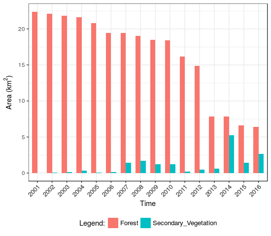

Fig. 10. Number of Forest and Secondary Vegetation

</td>
</tr>
</table>

 

