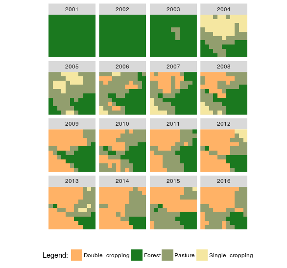
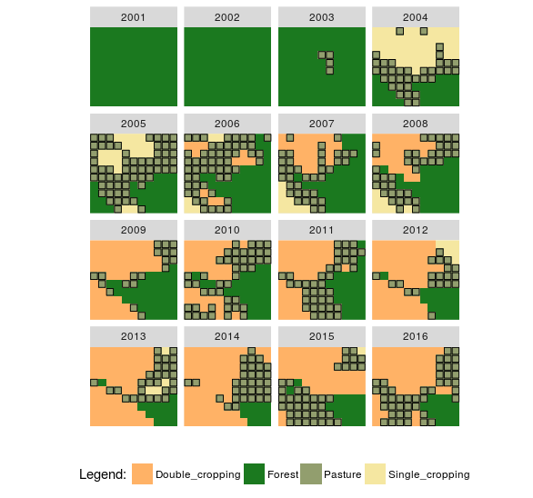
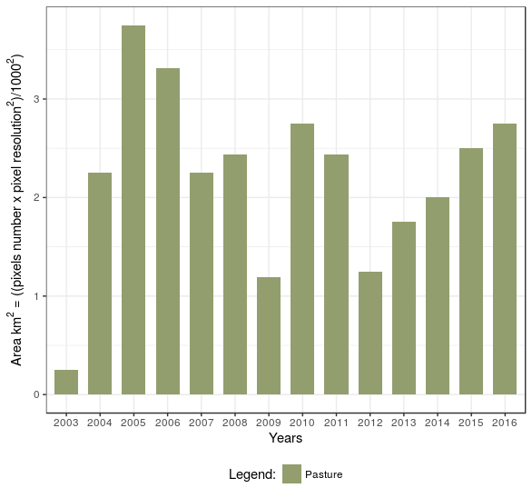
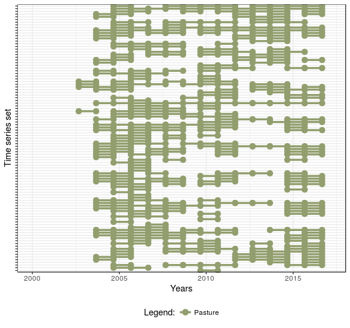
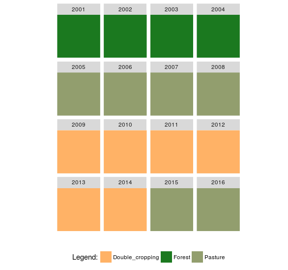
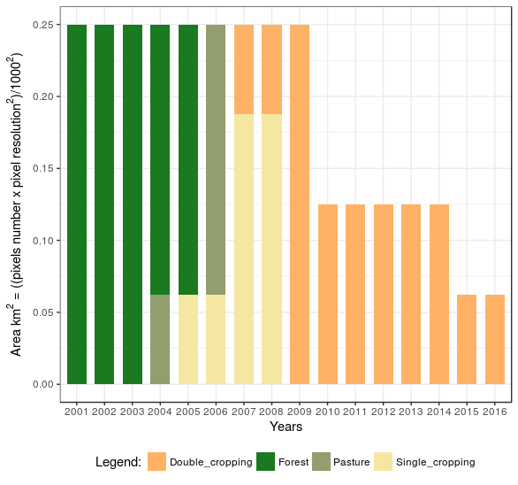
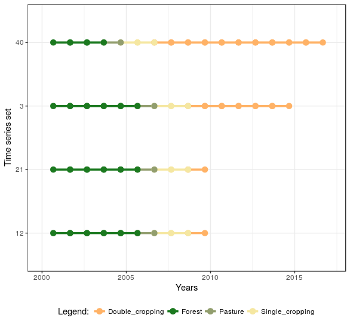

<h2>SITS using Land Use Change Calculus (sits.LUC.Calculus) (LUC Calculus)</h2>

This package implements the LUC Calculus for reasoning about land use change events. Based on a set of classified time series, we build expressions to answer specific questions, such as <i>Which events of "Forest" areas were replaced by "Pasture"?</i>

With package "sits.LUC.Calculus" is possible to build questions using Allen's interval temporal logic relationships and also others extended from their study. I suggest the reader read <a href="http://cse.unl.edu/~choueiry/Documents/Allen-CACM1983.pdf"> (Allen 1983)</a> and <a href="http://www.cs.ucf.edu/~lboloni/Teaching/EEL6938_2007/papers/Allen-GeneralTheoryActionTime.pdf"> (Allen 1984) </a> for more details. Besides, is possible to generate graphics with event information and plot maps with results. Using these events the user can to perform analysis on time series data to discover important land use changes.

Classification method and others tools to Satellite Image Time Series analysis can be found using package sits at <a href="https://github.com/e-sensing/sits">https://github.com/e-sensing/sits</a>

<h3>Prerequisites: </h3> 
<ul>
  <li><a href="http://git-scm.com/">Git</a></li>
  <li><a href="http://www.r-project.org/">R</a></li>
  <li><a href="http://www.rstudio.com/">Rstudio</a></li>
  <li>A set of classified GeoTIFF images by year </li>
  <li>The sits.LUC.Calculus requires "devtools" package is available. </li> 
</ul>

<h3>How to use the package:</h3>
<ul>
  <li>Open RStudio</li>
  <li>Install devtools <code>install.packages("devtools")</code> </li>
  <li>Load devtools <code>library(devtools)</code> </li>
  <li>Install the sits.LUC.Calculus package <code>install_github("ammaciel/sits.LUC.Calculus")</code> </li>
</ul>

 
<h3>Example 1</h3>

 - Load the lucC package <code>library(sits.LUC.Calculus)</code>

 - ... change 
 - Load a example data <code>data("example_TWDTW")</code>

 - Create new variable tibble format and apply lucC_standard_date_events to standardize start_date and end_date columns
<pre class="R">
# alter start_date and end_date to a especific range in order to extract events
lucC_starting_point()
data_tb <- example_TWDTW %>% 
  lucC_standard_date_events(data_tb = ., month_year = "09", day_month = "01") %>% 
  dplyr::select(longitude, latitude, start_date, end_date, label, id, index)
data_tb
</pre>

 - Plot example_1.tb <code>lucC_plot_maps_input(data_tb, EPSG_WGS84 = TRUE, custom_palette = TRUE, RGB_color = c( "#FFB266", "#1b791f",  "#929e6e", "#f5e7a1"))</code>

<table width="700" border="0">
<tr>
<td align="center" valign="center">

Fig. 1. Plot time series classified data

</td>
</tr>
</table>

 - Apply lucC_predicate_holds function to discover events of <i>Pasture</i>. For this is necessary create a for loop to read all data and not only one pixel over time 

<pre class="R">
# p = properties of locations :
p1 <- "Pasture"

# t = interval:
t1 <- lucC_interval("2000-09-01","2017-03-01")

# Test holds for many time series 
question_holds <- function(data.tb){
  
  aux.df = NULL
  if (nrow(event2 <- lucC_predicate_holds(data.tb, p1, t1)) >= 1)
    aux.df <- event2
  else
    aux.df <- NULL
  
  data.frame(aux.df)
  
}

temp.tb <- data_tb

output.tb = data.frame(do.call("rbind", parallel::mclapply( X = split(temp.tb, temp.tb$index), 
                                                            mc.cores=1, #parallel::detectCores(),
                                                            FUN = question_holds)))
output.tb
</pre>

 - See example_1.tb plot with lucC_plot_maps_input function <code>lucC_plot_maps_input(data_tb, EPSG_WGS84 = TRUE, custom_palette = TRUE, RGB_color = c("#FFB266", "#1b791f",  "#929e6e","#f5e7a1"))</code>

 - See all events with lucC_plot_maps_events function <code>lucC_plot_maps_events(output.tb, EPSG_WGS84 = TRUE, custom_palette = TRUE, RGB_color = c("#FFB266", "#1b791f",  "#929e6e","#f5e7a1"), shape_point = 0, colour_point = "black", size_point = 2.3)</code>

<table width="700" border="0">
<tr>
<td align="center" valign="center">

Fig. 2. Plot events discovered from time series classified data

</td>
</tr>
</table>

- See barplot total area in square kilometers <code>lucC_plot_bar_events(output.tb, custom_palette = TRUE, RGB_color = "#929e6e", pixel_resolution = 231.6564, side_by_side = FALSE)</code> and sequence plot <code>lucC_plot_sequence_events(output.tb, end_date = "2017-03-01", custom_palette = TRUE, RGB_color = "#929e6e", show_y_index = FALSE)</code>

<table width="700" border="0" cellspacing="0" cellpadding="0">
<tr>
<td align="center" valign="center">

 
Fig. 3.(a) Barplot with total area
</td>

<td align="center" valign="center">

 
Fig. 3.(b) Sequence plot
</td>

</tr>
</table>

 
<h3>Example 2</h3>

- Apply lucC_predicate_holds function to discover events for only one pixel with events of <i>Forest and Pasture</i>. 

<pre class="R">
# load library
library(lucC)
lucC_starting_point()

# load data example
data("example_TWDTW")
example_TWDTW

# alter start_date and end_date to a especific range in order to extract events
# because we work with annual intervals
# select only one time serie with index equals 13
data_tb <- example_TWDTW %>% 
  lucC_standard_date_events(data_tb = ., month_year = "09", day_month = "01") %>% 
  dplyr::select(longitude, latitude, start_date, end_date, label, id, index) %>% 
  dplyr::filter(., .$index == 13)
data_tb

# p = properties of locations :
p1 <- "Forest"
p2 <- "Pasture"

# t = interval:
t1 <- lucC_interval("2000-09-01","2004-09-01")
t2 <- lucC_interval("2004-09-01","2017-09-01")

# Test holds for one time serie
question_holds <- function(data.tb){
  
  aux.df = NULL
  
  if (nrow(ev1 <- lucC_predicate_holds(data.tb, p1, t1)) >= 1 &
      nrow(ev2 <- lucC_predicate_holds(data.tb, p2, t2)) >= 1 ){
    
    if(nrow(ev1) != 0 & nrow(ev2) != 0){
      
      if(isTRUE(lucC_relation_meets(tail(lucC_interval(ev1$start_date, ev1$end_date), 1),
                                    head(lucC_interval(ev2$start_date, ev2$end_date), 1))))
        aux.df <- rbind(ev1,ev2)
    } else 
      aux.df <- NULL
    
  } else {
    aux.df <- NULL
  }
  
  data.frame(aux.df)
}

temp.tb <- data_tb
output.tb2 = data.frame(do.call("rbind", parallel::mclapply( X = split(temp.tb, temp.tb$index), 
                                                             mc.cores=1, #parallel::detectCores(),
                                                             FUN = question_holds)))
output.tb2
</pre>

 - View example_2.tb plot with lucC_plot_maps_input function <code>lucC_plot_maps_input(data_tb, EPSG_WGS84 = TRUE, custom_palette = TRUE, RGB_color = c("#FFB266", "#1b791f", "#929e6e"))</code>

 - View all events with lucC_plot_maps_events function <code>lucC_plot_maps_events(output.tb2, EPSG_WGS84 = TRUE, custom_palette = TRUE, RGB_color = c("#FFB266", "#1b791f", "#929e6e"), shape_point = 4, colour_point = "blue", size_point = 8)</code>

<table width="700" border="0" cellspacing="0" cellpadding="0">
<tr>
<td align="center" valign="center">

 
Fig. 4.(a) Pixel over time
</td>

<td align="center" valign="center">

 
Fig. 4.(b) Pixel with events
</td>

</tr>
</table>

 
<h3>Example 3</h3>

 - Apply lucC_predicate_holds function to discover for a sequence of events of <i>Forest, Pasture, Single cropping and Double cropping</i> in this order. 

<pre class="R">
# load library
library(lucC)
lucC_starting_point()

# load data example
data("example_TWDTW")
example_TWDTW

# alter start_date and end_date to a especific range in order to extract events
# because we work with annual intervals
data_tb <- example_TWDTW %>% 
  lucC_standard_date_events(data_tb = ., month_year = "09", day_month = "01") %>% 
  dplyr::select(longitude, latitude, start_date, end_date, label, id, index) 
data_tb

# p = properties of locations :
p1 <- c("Forest", "Pasture", "Single_cropping", "Double_cropping")

# t = interval:
t1 <- lucC_interval("2000-09-01","2017-09-01")

# Test holds for one time serie
question_holds <- function(data.tb){
  
  aux.df = NULL
  
  aux.df <- lucC_event_transitions(data.tb, properties = p1, time_intervals = t1)
  
  data.frame(aux.df)
}

temp.tb <- data_tb
output.tb3 = data.frame(do.call("rbind", parallel::mclapply( X = split(temp.tb, temp.tb$index), 
                                                             mc.cores=1, #parallel::detectCores(),
                                                             FUN = question_holds)))
output.tb3
</pre>

 - See plot with lucC_plot_maps_input function <code>lucC_plot_maps_input(data_tb, EPSG_WGS84 = TRUE, custom_palette = TRUE, RGB_color = c("#FFB266", "#1b791f",  "#929e6e","#f5e7a1"))</code>

 - View all events with lucC_plot_maps_events function <code>lucC_plot_maps_events(output.tb3, EPSG_WGS84 = TRUE, custom_palette = TRUE, RGB_color = c("#FFB266", "#1b791f",  "#929e6e","#f5e7a1"), shape_point = 0, colour_point = "blue", size_point = 2.3)</code>

<table width="700" border="0">
<tr>
<td align="center" valign="center">

Fig. 5. Plot events discovered from time series classified data

</td>
</tr>
</table>

- See barplot total area in square kilometers <code>lucC_plot_bar_events(output.tb3, custom_palette = TRUE, RGB_color = c("#FFB266", "#1b791f",  "#929e6e","#f5e7a1"), pixel_resolution = 250, side_by_side = FALSE)</code> and sequence plot <code>lucC_plot_sequence_events(output.tb3, show_y_index = FALSE, end_date = "2017-03-01", custom_palette = TRUE, RGB_color = c("#FFB266", "#1b791f",  "#929e6e","#f5e7a1"), relabel = FALSE, original_labels = c("Double_cropping", "Forest", "Pasture", "Single_cropping"), new_labels = c("DC","F","P","SC"))</code>

<table width="700" border="0" cellspacing="0" cellpadding="0">
<tr>
<td align="center" valign="center">

 
Fig. 6.(a) Barplot with total area
</td>

<td align="center" valign="center">

 
Fig. 6.(b) Sequence plot
</td>

</tr>
</table>

 

